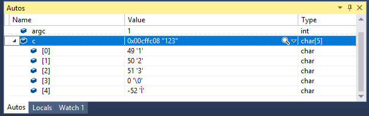

# Advanced Programming - Lab B

This lab introduces the reader to some key C++ input and output objects and functions using the console.

---

Locate the **Solution Explorer** within Visual Studio and select the **Streaming** project.

The code provided takes an integer and then a floating point number from the user and then displays the two numbers in the console window.

```c++
#include <iostream>

int main(int argn, char* argv[])
{
   int i;
   float f;
   // take an int and float from the console - seperated by a space, e.g. "1 6.7"
   std::cin >> i >> f;
   // output the int and float to the console
   std::cout << "i=" << i << ", x=" << f << std::endl;
}
```

This code creates an integer variable called `i` and a float variable called `f`.  It then takes the user input from the console (`cin`) by storing two numbers from the user into the two variables. The code then outputs to the console the values of the two variables.

Run this code and enter into the console window an integer followed by a space and then followed by a floating point number before pressing the return key (e.g. `23  4.567`).  The program should output the values of the two numbers.

---

## Q1. The Good `>>` Streaming Operator

Add the following line of code below the `#include`.

```c++
using namespace std;
```

This allows us to use the namespace std without explicitly adding `std::` before any object or function defined in that namespace.

Remove the `std::` from the `cin` and `cout` and `endl`.

Your code should still compile and run.

Add a third variable that is a `string` type.  You will need to add `#include <string>`.

Take a string value from the user after you take the float value (the user can enter something like `23  4.586  Hello` into the console window).

Then output the string value to the console after you output the float value.

**[LAB BOOK - Add your code to your lab book and describe your code]**

---

## Q2. The Bad `>>` Streaming Operator

The streaming operator `>>` can be used on most fundamental types and standard objects like string. However, it can lead to unexpected issues when storing values into an array.

```c++
#include <iostream>
using namespace std;

int main(int argn, char* argv[])
{
   char c[5];
   cin >> c;
   cout << "c=" << c << endl;
}
```

The above code will store characters from the console window into the char array called `c`.

Place a break point on the `cout` line of the code.  Run the above program.  In the console, enter the values `123` before selecting the return key.

In Visual Studio, select from the menu, **Debug -> Windows -> Autos**.  This will allow you to inspect values and memory addresses of variables etc.

Click on the triangle next to the variable `c`, and you should see the following output:


You can see that this variable can hold 5 chars as we defined it to do.  However, we are only using the first three and so we have the end of array character `\0` so that the system knows we are not using the whole array.
Continue to step threw the rest of the code so that you can see the output etc.

Run the program again, but this time enter the values `123456789` before selecting the return key.  Look at the value of `c` in the Autos window and you may see only the first 5 values but your code has tried to enter all 9 values into our variable.  Notice that we cannot see the `\0` end of array character - it is there but it is further along in memory from the start of the array so we cannot see it in the Autos window.
Continue to step throw your code and you should receive a Run-Time Check Failure that is alerting you of this issue.

In Visual Studio, change the build to **Release** and then select from the menu, **Debug -> Start Without Debugging**.  The whole 9 values should now be outputted because release will blindly output from the start of the array until it reaches the end array character.

The `>>` streaming operator is great for storing values into different types, but it should be avoided to store values into an array.

Replace `cin >> c` with the following code:

```c++
cin.get(c, 5);
```

This code will store up to 4 values followed by the end of array character.  Run your code as a normal **Debug** build and with the Debugger and inspect and document the values and see the output.  `get()` is usually safer for storing multiple characters in an array that the `>>` operator.

**[LAB BOOK - reflect on the nature and uses of the `>>` streaming operator and the `get()` function]**

---

## Other Input Functions [Not required in Lab Book]

Experiment with the other input stream functions that were discussed in the lecture(s).

---

## Q3. Assembly Language

Locate the **Solution Explorer** within Visual Studio and select the **Assembly** project.

The source.cpp file contains the following code:

```c++
#include <iostream>
using namespace std;

void main(int, char**) {
     const int start = 3;
     const int end = 10;
     int total = 0;

     int count = start;
     while (count < end) {
       total += count;
       count++;
     }

     cout << "Total= " << total << endl;
     system("PAUSE");
}
```

The program executes a single loop, adding the value of the loop counter to a running total.

Compile and run the program.

### Debugging

View `source.cpp` within Visual Studio.

Place a breakpoint on line:

```c++
const int start = 3;
```

The easiest way to place the breakpoint is to click in the margin of the main.cpp file.  The break point appears as a red circle.

Make sure that **Debug** mode is selected on the menu bar.

Run the program.

Execution should halt at your breakpoint.

Single step through your programme by pressing **F10**.  This executes one line of C++ code with each press.

Now open the Local variable windows by selecting **Debug->Windows->Local**.  This shows the values of all the C++ variables currently in scope.

Hit **F5** to execute the program to completion.

### Getting lost

Restart your programme and execute to the same break point as before.

Last time we used **F10** to execute a line of code.  If the code is a function call e.g. the streaming operator, then **F10** will execute the function call in a single press.

**F11** is similar to **F10**, but it will attempt to single step through a function.

Press **F11** until you enter the streaming operator.

Now you’re debugging the C++ streaming library!  Provided the source code is available, it is possible to debug any library in C++.

To avoid getting too lost, you can press **Shift-F11** to jump back out of the most recent function.

Press **shift-F11** now.

Hit **F5** to execute the program to completion.

### Disassemble

Restart your programme and execute to the same break point as again.

Now disassemble your code, by selecting **Debug->Windows->Disassembly**

You should get:

```asm
   const int start = 3;
001D5EA8 mov         dword ptr [start],3 
   const int end = 10;
001D5EAF  mov         dword ptr [end],0Ah 
   int total = 0;
001D5EB6  mov         dword ptr [total],0  
   int count = start;
001D5EBD  mov         dword ptr [count],3 
   while (count < end) {
001D5EC4  cmp         dword ptr [count],0Ah 
001D5EC8  jge         main+5Eh (01D5EDEh) 
      total += count;
001D5ECA  mov         eax,dword ptr [total] 
001D5ECD  add         eax,dword ptr [count] 
001D5ED0  mov         dword ptr [total],eax 
      count++;
001D5ED3  mov         eax,dword ptr [count] 
001D5ED6  add         eax,1 
001D5ED9  mov         dword ptr [count],eax 
   }
001D5EDC  jmp         main+44h (01D5EC4h) 
```

Familiarize yourself with the display.  You should see your C++ instruction above a series of assembly language instructions.  Reading the assembly language from left to right you should see the memory location, operation and finally the operands.  Note the memory locations will vary between executions.

Notice also that the execution point (yellow arrow) has moved from the C++ instruction to the assembly instruction

Hit **F5** to execute the program to completion.

### Registers

Execute your programme to the same break point as before, and open the **Disassembly** window.

Now open the **Register** window, by selecting **Debug->Windows->Registers**

Single step through the code by pressing **F10**

The execution point moves to the next assembly instruction and any registers that change are highlighted within the register window, in red.  In this case the **EIP** (instruction pointer) and **EFL** (flags) have changed.

Continue to execute your code one line at a time, taking note of the change in registers.

### Stack

Execute your programme to the same break point as before, and open the **Disassembly** window.

Now open the **Memory** window, by selecting **Debug->Windows->Memory**

Copy the address of the stack from the stack pointer within the **Register** window.

Paste the address into the edit field at the top of the **Memory** window.  You should now see the stack’s contents in the window.

Single step through the code and observe any changes to the stack.  You should be able to see changes to the contents of variables `count` and `total`.

### Release mode

Now select **Release** mode on the menu bar

Recompile the programme.

Execute your programme to the same break point as before, and open the **Disassembly** window.

Notice that the breakpoint has been moved, automatically.  The following line no longer has any associated assembly instructions

```c++
const int start = 3;
```

The optimizer has been at work!!!

Step through your code.  If it still exists it has been greatly optimized.  Much of the function overhead has been removed.

In **release** mode it is virtually impossible to associate a piece of assembly with its original C++.

Enjoy assembly language!!

---
