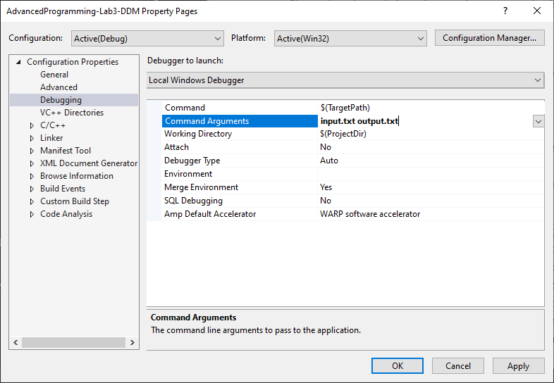

# Advanced Programming - Lab C

This lab introduces the reader to using File IO and function call mechanism in C++.

---
Locate the **Solution Explorer** within Visual Studio and select the **File Input Output** project.

Compile and run the provided code.

The program will display in the console something like:

```code
Usage: G:\500083\File-Input-Output\Debug\Copy.exe <input filename> <output filename>
```

The program displays this message because we have not provided the filename of an input file or an output file.  Look at the code in Main.cpp.  The program checks to see whether or not the user has passed these arguments to the program, as follows:

```c++
if (argn != 3) {
   cerr << "Usage: " << argv[0] << " <input filename> <output filename>" << endl;
   int keypress; cin >> keypress;
   return -1;
}
```

Firstly the code checks to see whether 3 arguments have been passed to the program.   The operating system will always pass at least one argument when the program is run, namely the file path to the program is passed to the program in `argv[0]`.  Therefore any argument that you pass to the program will be the second, third, fourth, etc.

---

## Q1. Passing Command Arguments

Our program will be required to copy a text file.
Therefore the program requires the user to send an input filename and an output filename as arguments.
One can do this in Visual Studio.
Select **Project**, then the project **Properties**, and then **Debugging**.
Then click inside of the **Command Arguments** box.
Here is where you enter the parameters to send to the program when it is run.
You should enter `input.txt output.txt` into the **Command Arguments** box as shown below.



This will mean that `argv[1]` will contain `input.txt` and `argv[2]` will contain `output.txt`.
Enter the two program arguments and then compile and run your program and you should not get any error message.

**[LAB BOOK - Record the steps required to enter arguments into Visual Studio]**

---

## Q2. Copying a Text File

Complete the functionality inside of the `Copy(char filenamein[], char filenameout[])` function.
You need to add code that will try to open a text file given by the `filenamein` array as the name of the input file.
You need to add code to create and output file using the `filenameout` array as the name of the ouput file.
Then you can add code that will take each char from the input file and put it in the output file.

Make sure that you check for the input and output files existence before trying to copy.

Test your code thoroughly, e.g. try providing filenames that do not exist.

**[LAB BOOK - Add you code to your lab book and reflect on how you tested your code]**

---

## Q3. Function call mechanism

Locate the **Solution Explorer** within Visual Studio and select the **Functions** project.

The `source.cpp` file contains the following code:

```c++
#include <iostream>
using namespace std;

int mymax(int a, int b) {
   if(a > b)
     return a;
   else
     return b;
}

int main(int, char **) {
   int a = 10;
   int b = 20;

   int max = mymax(a,b);

   return 0;
}
```

We want our program to calculate which of the two variable `a` and `b` is the largest.

Compile and run the program.

### Disassemble

View `source.cpp` within Visual Studio.

Place a breakpoint on line:

```c++
int a = 10;
```

This was covered in the previous lab.

Make sure that **Debug** mode is selected on the menu bar.

Run the program.

Execution should halt at your breakpoint.

Now disassemble your code, by selecting **Debug->Windows->Disassembly**.

You should get:

```asm
     int a = 10;
004131EE mov         dword ptr [a],0Ah  
     int b = 20;
004131F5  mov         dword ptr [b],14h 
     int max = mymax(a,b);
004131FC  mov         eax,dword ptr [b] 
004131FF  push        eax 
00413200  mov         ecx,dword ptr [a] 
00413203  push        ecx 
00413204  call        mymax (040124Eh) 
00413209  add         esp,8 
0041320C  mov         dword ptr [max],eax
```

Familiarise yourself with the display.  You should see your C++ instruction above a series of assembly language instructions.

### Functions

Execute your programme to the same breakpoint, and open the **Disassembly** window as before.

Now open the **Register** window, by selecting **Debug->Windows->Registers**

Single-step through the code by pressing **F11**

Continue to execute your code one line at a time, taking note of the change in register values.

Execute the following line:

```
00413204  call        mymax (040124Eh)
```

Notice that you move to a strange memory location before jumping again to your actual function.  This is just a Debug step added by the compiler.  It does not exist in **Release** mode.

Stop executing when you are at the following section of code

```asm
int mymax(int a, int b) {
00412350  push        ebp
00412351  mov         ebp,esp 
00412353  sub         esp,0C0h 
00412359  push        ebx 
0041235A  push        esi 
0041235B  push        edi 
0041235C  lea         edi,[ebp-0C0h] 
00412362  mov         ecx,30h 
00412367  mov         eax,0CCCCCCCCh 
0041236C  rep stos    dword ptr es:[edi]
```

This is the parameter passing section described in the lecturers.

Familiarize yourself with the code and continue executing until you return to your main programme.

It is recommended that you step through the previous section of code several times to fully understand how functions are called in C++.

Execute to the highlighted line.

```asm
cout << "a=" << a << ", b=" << b << endl;
0041320F  push        401505h 
00413214  mov         eax,dword ptr [b] 
00413217  push        eax 
00413218  push        4C96A0h 
0041321D  mov         ecx,dword ptr [a] 
00413220  push        ecx 
00413221  push        4C96A8h 
00413226  push        4EDFA8h 
0041322B  call        std::operator<<<std::char_traits<char> > (0401663h)   
```

Sometimes it is convenient to execute a line of assembly without actually seeing all the details.  This can be achieved by pressing **F10**.

Now ‘step over’ the call to the streaming function.  Notice how the function is executed (look in the command prompt window), but you have not entered the function.

Hit **F5** to execute the program to completion.

### Memory

Execute your programme to the previous breakpoint, and open the **Disassembly** window as before.

Execute to the highlighted line.

```asm
int max = mymax(a,b);
004131FC  mov         eax,dword ptr [b]  
004131FF  push        eax 
00413200  mov         ecx,dword ptr [a] 
00413203  push        ecx 
00413204  call        mymax (040124Eh) 
00413209  add         esp,8 
0041320C  mov         dword ptr [max],eax
```

Execute the next instruction and note the value of the EAX register.

The next instruction pushes the contents of the EAX register onto the stack.  Before we execute the instruction we will look at the stack in memory.

Open a **Memory** window, by selecting **Debug->Windows->Memory->’Memory 1’**.  This window shows the contents of an area of memory.

We need to move this window to look at the stack.  The location of the stack can be found in the stack pointer (ESP).  Look for this in the **Register** Window and copy the address.  Paste the address into the **Memory** window’s address box and press ENTER

You should now see your stack in the memory window.

Scroll UP the memory window by 4 lines.

Execute the next instruction and note change in the stack’s contents (The change is highlighted in red).  The reason for scrolling the window is so that you can observe the write to memory.  Otherwise, the PUSH instruction would write to memory above your visible window.

Execute the next 2 instructions and note the change in stack’s contents

Your stack should look similar to the stack dump below

```code
0x0018FE15  cc cc cc cc cc cc cc cc cc cc cc cc cc  ÌÌÌÌÌÌÌÌÌÌÌÌÌ
0x0018FE22  cc cc cc cc cc cc cc cc cc cc cc cc cc  ÌÌÌÌÌÌÌÌÌÌÌÌÌ
0x0018FE2F  cc 0a 00 00 00 14 00 00 00 00 00 00 00  Ì............
0x0018FE3C  00 00 00 00 00 e0 fd 7e cc cc cc cc cc  .....àý~ÌÌÌÌÌ
0x0018FE49  cc cc cc cc cc cc cc cc cc cc cc cc cc  ÌÌÌÌÌÌÌÌÌÌÌÌÌ
0x0018FE56  cc cc cc cc cc cc cc cc cc cc cc cc cc  ÌÌÌÌÌÌÌÌÌÌÌÌÌ 
```

Hit **F5** to execute the program to completion.

### Data sizes

In `source.cpp` we use variables `a` and `b`.  How many bytes do each of these variables occupy in memory?

Look at the memory dump above; can you verify your answer?

Each of the registers we have used so far in this program have been 32-bits in size e.g. EAX.  Look at the register window.  The values in each register are represented by 8 digits; 2 digits for each byte.

### Parameter types

Now modify the code and add in your own function that takes 3 parameters each of a different type.

From what you have learnt in the previous exercises, use the Debugger and Disassembly to investigate how the C++ parameter passing mechanism deals with these new parameters.

---
