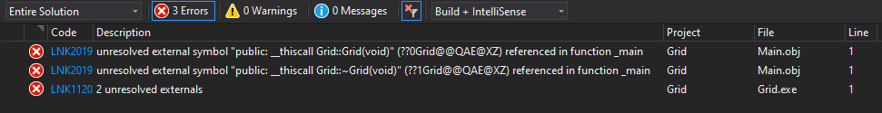
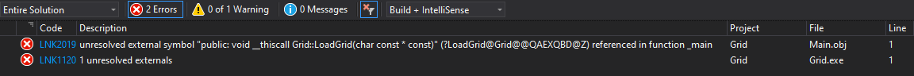
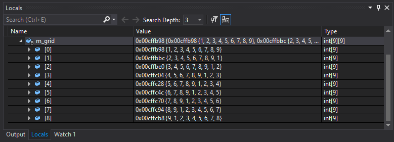
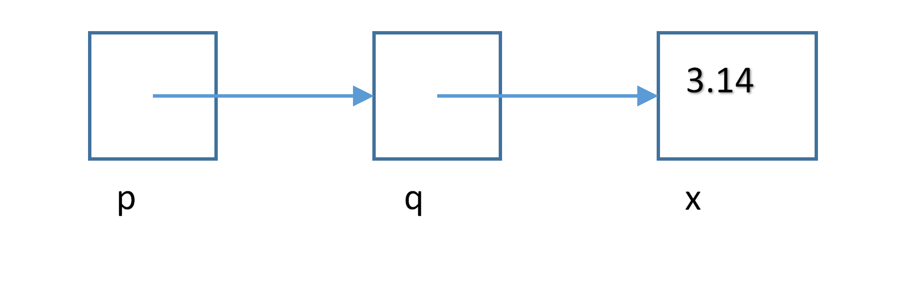
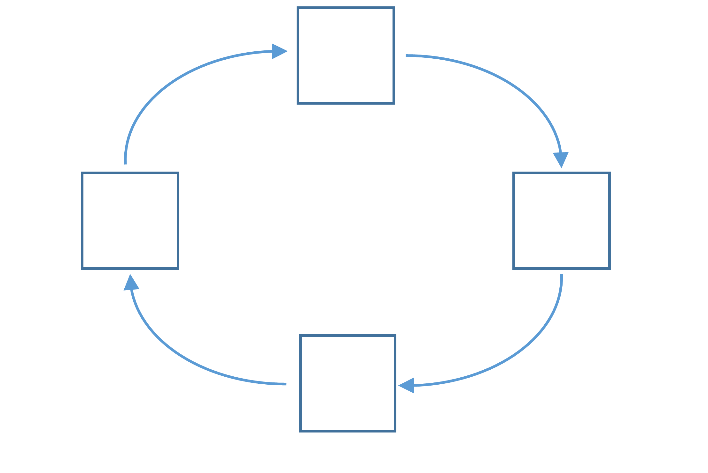

# Week 4
# Advanced Programming - Lab D
This lab introduces the reader to using classes and pointers in C++.


## Q1. Linker Errors

### Question

Locate the Solution Explorer within Visual Studio and select the Grid project.  You will find this to be an empty Project except for a text file called Grid1.txt.

Right-click on the Project Name (Grid) then select `Add -> Class...` from the menu.  Enter `Grid` as the Class Name and click Finish.  You should now have files `Grid.cpp` and `Grid.h` in your project.

Enter the following code into `Grid.h`.

```c++
#pragma once

class Grid
{
public:
   Grid();
   ~Grid();

   void LoadGrid(const char filename[]);
   void SaveGrid(const char filename[]);

private:
   int m_grid[9][9];
};
```

This Grid class will hold a 9x9 2D array of int values in `m_grid`.

We will load the values from a file and store them in this 9x9 int data structure using the method `LoadGrid(const char filename[])`.

We will be able to save the values in `m_grid` to a file using the method `SaveGrid(const char filename[])`.

Open the `Grid1.txt` file.
This file contains the int values that we will read and store in the `m_grid` data structure.
You will see that there are 9x9 int values separated by a space.
Therefore you can simply use the `>>` streaming in operator to read in these values as `>>` uses space values as a delimiter (separator), e.g. `fin >> m_grid[x][y];`.

Right-click on the Project Name (Grid) then select `Add -> New Item...` from the menu.
Select `C++ File (.cpp)` and enter `Main.cpp` as the Name and click Finish.
You should now have the file `Main.cpp` in your Project.  

Enter the following code in to Main.cpp.

```c++
#include <iostream>
#include "Grid.h"
using namespace std;

int main(int argn, char *argv[])
{
   Grid grid;
// grid.LoadGrid("Grid1.txt");
// grid.SaveGrid("OutGrid.txt");

   system("pause");
}
```

This code creates an instance of `Grid`, called `grid`.

Try to compile your code - you should get a **Linker Error** that looks something like the following.



The **LNK** of the error codes are telling you that the linker could not find something(s), in this case it could not find the source code for the constructor `Grid::Grid()` or the destructor `Grid::~Grid()` (if you have not heard of a destructor then you will do soon as part of this module.
These errors are because we have specified the prototype for these in the `Grid.h` file, but we have not yet implemented them in the `Grid.cpp` file.

Therefore, add the following code to your `Grid.cpp` file.

```c++
Grid::Grid()
{
}

Grid::~Grid()
{
}
```

Make sure that your code now compiles, although it will not do anything if you run it.

**[LAB BOOK - Describe what is required in the `.h` and `.cpp` files of a class so that you can define a constructor or method]**

### Answer

To define a constructor, destructor, or any method in a c++ class, you must first declare them in the class's header file, in this case, 'Grid.h', then provide their definitions in an implementation file, in this case 'Main.cpp'.

The header file will outline what the class does, with the implementation file providing the logic of how the class's constructors destructors and methods operate on its data.

The header file needs to begin with declaring the class, the constructor and destructor, the public methods and the private data members.

The implementation file needs to include the class header, the constructor and destructor definition, and the method definition.
---

## Q2. Reading into Grid Class

### Question

Open `Main.cpp`.  Remove the comments ( `//` ) in the `LoadGrid()` method line of code, so you have the following.

```c++
#include <iostream>
#include "Grid.h"
using namespace std;

int main(int argn, char* argv[])
{
	Grid grid;
	grid.LoadGrid("Grid1.txt");
	// grid.SaveGrid("OutGrid.txt");

	system("pause");
}
```

Try to compile your code - you should get a **Linker Error** that looks something like the following.



The **LNK** again is telling you that the linker could not find something, in this case it could not find the source code for the `Grid::LoadGrid(char const * const)` method.  This is because we have specified the prototype in the `Grid.h` file, but we have not yet implemented this method in the `Grid.cpp` file.

Implement the `Grid::LoadGrid(const char filename[])` method in Grid.cpp.  This method should follow the following pseudo code.

```
Create an input file stream from filename
for each y value from 0 to 8 inclusive
{
   for each x value from 0 to 8 inclusive
   {
      store next value from the input file stream into grid at x,y
   }
}
Close input file stream
```

You will need to include the `fstream` library in your `Grid.cpp` file.

After you have implemented this, step through this method to make sure that it correctly reads and stores the values of the grid file into m_grid - it should look something similar to the values below.



**[LAB BOOK - Add you code for method `Grid::LoadGrid` and describe how you implemented it]**

### Answer
```cpp
void Grid::LoadGrid(const char filename[])
{
    std::ifstream fileStream(filename); 

    if (!fileStream)
    {
        std::cout << "Could not open the file: " << filename << std::endl;
        return;
    }

    for (int y = 0; y < 9; ++y) 
    {
        for (int x = 0; x < 9; ++x) 
        {
            fileStream >> m_grid[y][x]; 
        }
    }

    fileStream.close();
}

```
The LoadGrid function is defined, it opens a file with the filename passed into it, then validates if it is able to open that file. If it can, it starts two for loops from 0-8 inclusive, representing the x and y axis for this 9x9 array. after every pass through, it stores the value at the coordinates x and y into the grid m_grid. After it has finished, it closes the file stream. 
---

## Q3. Saving the Grid
### Question
Implement the `SaveGrid(const char filename[])` method.
This method will save the values of `m_grid` in a similar format to that of the `Grid1.txt` file.
Please use another name for the output file so that your `Grid1.txt` file is not overwritten.

**[LAB BOOK - Add you code for method `Grid::SaveGrid` and describe how you implemented it]**

### Answer

```cpp
void Grid::SaveGrid(const char filename[])
{
    std::ofstream fileStream(filename);

    if (!fileStream)
    {
        std::cout << "Could not open the file: " << filename << std::endl;
        return;
    }

    for (int y = 0; y < 9; ++y)
    {
        for (int x = 0; x < 9; ++x)
        {
            fileStream << m_grid[y][x] << " ";
        }
        fileStream << std::endl;
    }
    fileStream.close();
}
```

Tge SaveGrid function is defined, it opens a file with the filename passed into it, then validates if it is able to open that file. If it can, it starts two loops from 0-8 inclusive, representing the x and y axis for this 9x9 array. After every column, it outputs the value present in m_grid separated by a space, and after every row it creates a new line. After it has finished, it closes the file stream. 

---

## Q4. Pointers - Basics
### Question
Open the project "Pointers"

Located the following code in source.cpp file:

```c++
void functionA() {
   int a = 10;
   int b = 20;
   int *p = &a;

   cout << "a= " << a << endl;
   cout << "b= " << b << endl;

   // Add your code here

   cout << "a= " << a << endl;
   cout << "b= " << b << endl;
}
```

The program initializes two integer variables `a` and `b`, with the values 10 and 20 respectively.  A pointer `p` is initialized to point at `a`.

Compile and run the program.

Add a line of code, at the position indicated by the comment, to assign the value of 100 to `a`, by using only the pointer `p`.

Run the code to check the output.

Now set a breakpoint at the line

```c++
int a = 10;
```

Run the code to the breakpoint, then single-step through the code whilst looking at the variables in the Local window.

Notice how `a` and `b` are initialized with values 10 and 20, and that pointer `p` is assigned a hexadecimal value.  This value is the memory location of `a`.

Open a **Memory window**.   Copy the value of `p` into the address field of the **Memory window** and confirm that you are looking at variable `a` in memory.

### Answer
I added the line of code ``` *p = 100; ``` where the comment for adding code was. I put a breakpoint on the first line and stepped through until I got the memory address of integer 'a' through integer pointer 'p', '0x006FFA44'. I pasted this address into a memory window and saw where in memory the integer was stored. 

---

## Q5. Pointers - False assumptions
### Question

Comment out the call to `functionA` and uncomment the call to `functionB`.

```c++
void functionB() {
   int a = 10;
   int b = 20;
   int c = 30;
   int *p = &b;

   cout << "a= " << a << endl;
   cout << "b= " << b << endl;
   cout << "c= " << c << endl;

   *p = 100;

   cout << "a= " << a << endl;
   cout << "b= " << b << endl;
   cout << "c= " << c << endl;
} 
```

Compile and run the program.

Observe the result.

Now we’ll attempt to do a quick "hack" and advance the pointer 4 bytes in memory from the location of variable `b` to the location of variable `c`

After line

```c++
*p = 100;
```

Add

```c++
p++;
*p = 200;
```

Compile and run the program.

Is this what you expected?

Set a breakpoint and single-step through the code whilst observing the Locals window.

The pointer does get advanced by 4 bytes, but the memory location is invalid.  Just because we list variables `a`, `b`, and `c` sequentially in our programme, does not guarantee that the compiler places them contiguously in memory.

If you want to do this sort of pointer arithmetic then you need to guarantee the memory layout.  Arrays are a way to achieve this.  We’ll look at these later in the module.

For now, just be careful using pointer arithmetic.  This time we were lucky and the C++ run time checking detected the error for us.  You cannot rely on the run time finding more complex errors.

### Answer
I edited the functionB code to try and advance the pointer 4 bytes in memory from the location of variable 'b' only to be met by "Run-Time Check Failure #2 - Stack around the variable 'b' was corrupted". I expected this to not work but I did not have a reason to really suspect that. Now I know that just because we list variables `a`, `b`, and `c` sequentially in our programme, does not guarantee that the compiler places them contiguously in memory.

---

## Q6. Pointers - The crash

### Question

Comment out the call to `functionB` and uncomment the call to `functionC`.

Compile and run the program.

The program crashes, why?

Set a breakpoint at line

```c++
unsigned int a = 0x00ff00ff;
```

Single-step through the code and determine the reason for the crash.

The Windows operating system attempts to prevent applications from damaging other applications.  This error message is from Windows telling you that your code has attempted to access a memory location outside of its permitted memory footprint.

---

### Answer
I ran the program initially and it crashed, giving me "Exception thrown: write access violation. p was 0xFF00FF.". I suspect this is because the function attempts to assign the value '999' to a point in memory which is invalid or not accessible by the program. From my understanding, a "write access violation" happens when a program does not have permission to write to a specific memory address because the operating system is not allowing it. This will be to prevent breaking core parts of memory essential for running the computer.


## Q7. Pointers - Pointers to pointers
### Question

Comment out the call to `functionC` and uncomment the call to `functionD`.



Add code, at the position identified by the comment, to implement the above pointer chain.

You will need to declare two new pointers `p` and `q`.

Then add the code to change the value of `x` by using only pointer `p`.

Compile and run the program.  Checking your solution with the debugger and disassembler.

### Answer
I altered function D. 

```cpp
void functionD() {
	double x = 3.14;

	cout << "x= " << x << endl;

	double *q = &x;
	double *p = q;

	*p = 2.1;

	cout << "x= " << x << endl;
}
```
I initialized a new double pointer 'q' and pointed it to the memory address of 'x'. I then initialized a new double pointer 'p' then pointed it to 'q', therefore pointing it to the memory address of 'x'. By altering the pointer value of 'p', it actually travels down the chain of pointers and changes the value of x. This code works as intended, with the console outputting:

```
x= 3.14
x= 2.1
```
---

## Q8. Pointers - Pointer chains (optional)
### Question
How would you implement the following in C++?



**Hint:** You might find `void` useful.

### Answer
Creating a loop of 4 pointers where each pointer points to the next one, and the last pointer points back to the first one is possible, however, can be dangerous as it leads to confusion, undefined behavior and bugs that are hard to track. 

Here is an example of this pointer chain.

```cpp
void functionE() {
	int a = 10;
	void* p1 = &a; 
	void* p2 = &p1; 
	void* p3 = &p2; 
	void* p4 = &p3;  

	p1 = &p4;
}
```

I had to use pointers of the 'void' type as it is a generic pointer type in C++ that can point to any type of data.

## Reflection
Through this lab I have furthered my ability of understanding the basics of classes in C++. Whilst not directly adding anything to them, I understood more about how constructors and destructors work, and have implemented my first C++ header file.

In the second part of this lab, I increased familiarity with pointers in C++. Implementing basic functions that feature them to achieve simple goals. I have furthered my knowledge of use cases, and understood how to use the debugging tools in visual studio to see exactly where a pointer is pointing to in memory. I understand more on the power and constraints that pointers can bring to a program, and I even did the silly optional task of the dangerous pointer chain.

I am very excited to continue understanding the complex language of C++ and I cannot wait to see how pointers will play out in a more real-world environment when programming in C++.
