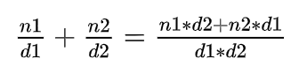

# Advanced Programming - Lab E

This tutorial introduces the reader to using operators and parameters in C++.

---

## Q1. Operators in Grid

Extend your code from Q2 and Q3 in Lab D. 

Add the following functionality to your program:

- The ability to write the Grid to an `ostream` using the auxiliary `operator<<`
- The ability to read in the values from an `istream` into the Grid using the auxiliary `operator>>`

**[LAB BOOK - Copy your code for these functions into your lab book]**

---

## Q2. Fractions

Open the **Fractions** project

Implement the Fraction class that you have seen in lectures.  Use the header file example that was presented in lectures to define your class, methods, member variables etc.

Methods will include:

- Constructors
- Add Fraction (see equation 1 for help)
- Subtract Fraction
- Multiply by int
- Multiply with Fraction (optional)
- Divide by int (optional)
- Divide by Fraction (optional)
- Inspector (getter) for the Numerator
- Inspector (getter) for the Denominator
- Mutator (setter) for the Numerator
- Mutator (setter) for the Denominator
- Write
- Read



**Equation 1 - Adding two fractions**

Use the following code to test your `Fraction` class:

```c++
#include "Fraction.h"
#include <iostream>
using namespace std; 

int main(int args, char** argv)
{
    Fraction f1(1, 2);        // 1/2
    Fraction f2(3, 4);        // 3/4
    Fraction result;

    result = f1.Add(f2);      // 1/2 + 3/4 = 10/8
    cout << "1/2 + 3/4 = ";
    result.Write(cout);
    cout << endl;

    result = f2.Subtract(f1); // 3/4 - 1/2 = 2/8
    cout << "3/4 - 1/2 = ";
    result.Write(cout);  
    cout << endl;

    result = f2.Multiply(3);  // 3/4 * 3 = 9/4
    cout << "3/4 * 3 = ";
    result.Write(cout);
    cout << endl;

    Fraction f3;
    f3.Read(cin);             // input format is up to you, e.g. "1 2" to represent 1/2
    cout << "Read = ";
    f3.Write(cout);
    cout << endl;

    system("pause");
}
```

**[LAB BOOK - Copy your code for your Fraction methods into your lab book]**

---

## Q3. - Operators in Fraction

Add the following functionality to your `Fraction` class:

- The ability to add two Fractions together using the **class member operator** `operator+`
- The ability to subtract one Fraction from another fraction using the **class member operator** `operator-`
- The ability to multiply a Fraction with an int using the **class member operator** `operator*`
- The ability to multiply an int with a Fraction using the **auxiliary operator** `operator*`

Add the following code to main to test your `Fraction` class:

```c++
    result = f1 + f2;     // 1/2 + 3/4 = 10/8
    cout << "1/2 + 3/4 = " << result << endl;

    result = f2 - f1;     // 3/4 - 1/2 = 2/8
    cout << "3/4 - 1/2 = " << result << endl;

    result = f2 * 3;      // 3/4 * 3 = 9/4
    cout << "3/4 * 3 = " << result << endl;

    result = 3 * f2;      // 3/4 * 3 = 9/4
    cout << "3 * 3/4 = " << result << endl;

    Fraction f4;
    cin >> f4;            // input format is up to you, e.g. "1 2" to represent 1/2
    cout << "Read = " << f4 << endl;
```

**[LAB BOOK - Copy your code for your operators into your lab book.  Reflect on the difference between class operators and auxiliary operators]**

---

## Q4. Parameters

Open and build the **Parameters** project

The **source.cpp** file contains the following code:

```c++
#include <iostream>
using namespace std;

void myswap(int lhs, int rhs) {
    int temp = lhs;
    lhs = rhs;
    rhs = temp;
}
 
void main(int, char**) { 
    int a = 10;
    int b = 20;

    cout << "a=" << a << ", b=" << b << endl;

    myswap(a, b);

    cout << "a=" << a << ", b=" << b << endl;

    system("PAUSE");
}
```

We want our program to swap the values of the two variables `a` and `b`.

Compile and run the program.

It does not give the correct answer; `a` and `b` are not swapped.

### Pass by value

View **source.cpp** within Visual Studio.

Place a breakpoint on:

```c++
myswap(a, b);
```

Run the program.  Execution should stop at the breakpoint.  Now open both the **dissembler** window and the **register** window.

Open a **memory** window and set it to look at the location of the stack (see the previous lab)

You are now in a position to debug the code.

Single-step through the assembly, watching how the values of `a` and `b` are pushed onto the stack.

Remember to use `F11` and not `F10`, so you can jump into the `myswap` function

When you get to the following line, `F11` will not appear to do anything.  This assembly instruction is actually a very small loop, consisting of one line of code.  Repeated presses of `F11` will execute each iteration of the loop in turn.  `F10` will execute the entire loop and jump to the next instruction.

```assembly
00165D6C  rep stos    dword ptr es:[edi]
```

Remember to keep an eye on the Locals window to see the values of your C++ variables.

At the end of the myswap function the values of the variables have been swapped.  You can see in the **Locals** window.

When you return from the `myswap` function, notice how no data is actually copied back to the original variables.

### Pass by reference

Rewrite the previous code to pass the variables `a` and `b` into the `myswap` function by reference, rather than by value.

Compile and run you code.  Did this swap the values?  It should have worked.

Repeat the debugging process from the previous section.  Place a breakpoint on the `myswap` call, run the program and then disassemble

Single-step through the calling process.

Notice how the values of 10 and 20 are no longer pushed onto the stack.  Instead, the address of the variables `a` and `b` are pushed onto the stack.

Find the address of `a` in the appropriate register, and use the address to look at the memory that holds the value for the variable `a`.

### Pass by address (optional)

Repeat the previous section but this time rewrite the `myswap` function to pass the parameters by address.

**[LAB BOOK - Copy your code for pass-by-value and pass-by-ref into your lab book.  Reflect on the difference between them]**

## Q5. Return by value

Replace the `myswap` function with the `clamp` function

```c++
int clamp(int value, int low, int high) {
    if (value < low)
        return low;
    if (value > high)
        return high;
    return value;
}
```

This function clamps or limits a value between an upper and lower bound.

Add a call to the `clamp` function in `main`.

Repeat the dissembling process but this time focus on the return value.

Notice how the return value is copied onto the stack.

Check the value is correct on the stack.

### Return by reference

Add this alternative `clamp` function

```c++
int& clamp(int& value, int low, int high) {
    if (value < low)
        return low;
    if (value > high)
        return high;
    return value;
}
```

Repeat the dissembling process focusing on the return value.

Notice how the return value is copied onto the stack, but unlike the previous exercise this return value is actually the address of the variable value

Check that this address is correctly stored on the stack.

Try calling your function using the following code

```c++
    int value1 = 10;
    int value2 = 20;
    int result1 = clamp(value1, 0, 30) + clamp(value2, 0, 30); 
```

Does `result1` hold the correct value?

Now try:

```c++
    int result2 = clamp(value1, 0, 5) + clamp(value2, 0, 10);
```

Does `result2` hold the correct value?  
Can you explain what is happening?

**[LAB BOOK - Copy your code for return-by-value and return-by-ref into your lab book.  Reflect on the difference between them]**