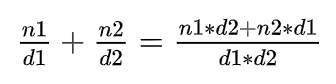

# Advanced Programming - Lab E

This tutorial introduces the reader to using operators and parameters in C++.

---

## Q1. Operators in Grid

### Question

Extend your code from Q2 and Q3 in Lab D. 

Add the following functionality to your program:

- The ability to write the Grid to an `ostream` using the auxiliary `operator<<`
- The ability to read in the values from an `istream` into the Grid using the auxiliary `operator>>`

**[LAB BOOK - Copy your code for these functions into your lab book]**

---
### Answer

```cpp
#pragma once
#include <iostream>

class Grid
{
public:
	Grid();
	~Grid();

	void LoadGrid(const char filename[]);
	void SaveGrid(const char filename[]);
	friend std::ostream& operator << (std::ostream& os, const Grid& grid);
	friend std::istream& operator >> (std::istream& is, Grid& grid);

private:
	int m_grid[9][9];

};
```

```cpp
std::ostream& operator << (std::ostream& os, const Grid& grid) {
    for (int y = 0; y < 9; ++y)
    {
        for (int x = 0; x < 9; ++x)
        {
            os << grid.m_grid[y][x] << " ";
        }
        os << std::endl;
    }
    return os;
}

std::istream& operator >> (std::istream& is, Grid& grid) {
    for (int y = 0; y < 9; ++y)
    {
        for (int x = 0; x < 9; ++x)
        {
            is >> grid.m_grid[y][x];
        }
    }
    return is;
}
```

```cpp
#include <iostream>
#include "Grid.h"
using namespace std;

int main(int argn, char* argv[])
{
	Grid grid;
	std::cin >> grid;
	std::cout << endl;
	std::cout << grid << std::endl;

	system("pause");
}
```

I created functions that allow the user to input and output a grid. Doing them this way is better as it more natively works with the streaming operators, leading to easier to work with and understand code. Instead of outputting a grid to console using ```LoadGrid()```, you can output it with ```std::cout << grid << std::endl;```.

## Q2. Fractions
### Question
Open the **Fractions** project

Implement the Fraction class that you have seen in lectures.  Use the header file example that was presented in lectures to define your class, methods, member variables etc.

Methods will include:

- Constructors
- Add Fraction (see equation 1 for help)
- Subtract Fraction
- Multiply by int
- Multiply with Fraction (optional)
- Divide by int (optional)
- Divide by Fraction (optional)
- Inspector (getter) for the Numerator
- Inspector (getter) for the Denominator
- Mutator (setter) for the Numerator
- Mutator (setter) for the Denominator
- Write
- Read



**Equation 1 - Adding two fractions**

Use the following code to test your `Fraction` class:

```c++
#include "Fraction.h"
#include <iostream>
using namespace std; 

int main(int args, char** argv)
{
    Fraction f1(1, 2);        // 1/2
    Fraction f2(3, 4);        // 3/4
    Fraction result;

    result = f1.Add(f2);      // 1/2 + 3/4 = 10/8
    cout << "1/2 + 3/4 = ";
    result.Write(cout);
    cout << endl;

    result = f2.Subtract(f1); // 3/4 - 1/2 = 2/8
    cout << "3/4 - 1/2 = ";
    result.Write(cout);  
    cout << endl;

    result = f2.Multiply(3);  // 3/4 * 3 = 9/4
    cout << "3/4 * 3 = ";
    result.Write(cout);
    cout << endl;

    Fraction f3;
    f3.Read(cin);             // input format is up to you, e.g. "1 2" to represent 1/2
    cout << "Read = ";
    f3.Write(cout);
    cout << endl;

    system("pause");
}
```

**[LAB BOOK - Copy your code for your Fraction methods into your lab book]**

### Answer

#### fraction.cpp
```cpp
#include <iostream>
#include <assert.h>
#include "fraction.h"

// default constructor
Fraction::Fraction() {
	Num(0); Den(1);
}

// specific constructor
Fraction::Fraction(int num, int den) {
	Num(num); Den(den);
}

// arithmetic operations
Fraction Fraction::Add(const Fraction& rhs) const {
	return Fraction(Num() * rhs.Den() + Den() * rhs.Num(), Den() * rhs.Den());
}

Fraction Fraction::Subtract(const Fraction& rhs) const {
	return Fraction(Num() * rhs.Den() - Den() * rhs.Num(), Den() * rhs.Den());
}

Fraction Fraction::Multiply(int scale) const {
	return Fraction(Num() * scale, Den());
}

Fraction Fraction::Divide(int scale) const {
	assert(scale != 0);
	return Fraction(Num(), Den() * scale);
}

// getters and setters

int Fraction::Num() const {
	return m_num;
}

int Fraction::Den() const {
	return m_den;
}

void Fraction::Num(int num) {
	m_num = num;
}

void Fraction::Den(int den) {
	assert(den);
	m_den = den;
}

// input and output

void Fraction::Write(std::ostream& out) const {
	out << Num() << "/" << Den();
}

void Fraction::Read(std::istream& in) {
	int num, den;
	in >> num >> den;
	Num(num); Den(den);
}
```
#### fraction.h
```cpp
#pragma once
#include <iostream>

class Fraction {
public:
	// default constructor
	Fraction();
	// specific constructor
	Fraction(int num, int den);

	// arithmetic operations
	Fraction Add(const Fraction& rhs) const;
	Fraction Subtract(const Fraction& rhs) const;
	Fraction Multiply(int scale) const;
	Fraction Divide(int scale) const;

	// getters and setters
	int Num() const;
	int Den() const;

	void Num(int num);
	void Den(int den);

	// input and output
	void Write(std::ostream& out) const;
	void Read(std::istream& in);

	private:
		int m_num;
		int m_den;
};
```

#### main.cpp
```cpp
#include "Fraction.h"
#include <iostream>
using namespace std;

int main(int args, char** argv)
{
    Fraction f1(1, 2);        // 1/2
    Fraction f2(3, 4);        // 3/4
    Fraction result;

    result = f1.Add(f2);      // 1/2 + 3/4 = 10/8
    cout << "1/2 + 3/4 = ";
    result.Write(cout);
    cout << endl;

    result = f2.Subtract(f1); // 3/4 - 1/2 = 2/8
    cout << "3/4 - 1/2 = ";
    result.Write(cout);
    cout << endl;

    result = f2.Multiply(3);  // 3/4 * 3 = 9/4
    cout << "3/4 * 3 = ";
    result.Write(cout);
    cout << endl;

    Fraction f3;
    f3.Read(cin);             // input format is up to you, e.g. "1 2" to represent 1/2
    cout << "Read = ";
    f3.Write(cout);
    cout << endl;

    system("pause");
}
```
```
1/2 + 3/4 = 10/8
3/4 - 1/2 = 2/8
3/4 * 3 = 9/4
3/4 / 3 = 3/12
4 5
Read = 4/5
Press any key to continue . . .
```

I have added functionality to my fraction program to add and subtract two fractions together, divide or multiply a fraction by a constant int, and read and write fractions. In this state it does not allow for the optional multiplication or division of two fractions, however, I will move onto adding that functionality when I start to override operators in the next bit.

---

## Q3. - Operators in Fraction
### Question
Add the following functionality to your `Fraction` class:

- The ability to add two Fractions together using the **class member operator** `operator+`
- The ability to subtract one Fraction from another fraction using the **class member operator** `operator-`
- The ability to multiply a Fraction with an int using the **class member operator** `operator*`
- The ability to multiply an int with a Fraction using the **auxiliary operator** `operator*`

Add the following code to main to test your `Fraction` class:

```c++
    result = f1 + f2;     // 1/2 + 3/4 = 10/8
    cout << "1/2 + 3/4 = " << result << endl;

    result = f2 - f1;     // 3/4 - 1/2 = 2/8
    cout << "3/4 - 1/2 = " << result << endl;

    result = f2 * 3;      // 3/4 * 3 = 9/4
    cout << "3/4 * 3 = " << result << endl;

    result = 3 * f2;      // 3/4 * 3 = 9/4
    cout << "3 * 3/4 = " << result << endl;

    Fraction f4;
    cin >> f4;            // input format is up to you, e.g. "1 2" to represent 1/2
    cout << "Read = " << f4 << endl;
```

**[LAB BOOK - Copy your code for your operators into your lab book.  Reflect on the difference between class operators and auxiliary operators]**

### Answer

#### fraction.cpp

```cpp
#include "fraction.h"
#include <iostream>
#include <cassert>

// Default constructor
Fraction::Fraction() : m_num(0), m_den(1) {}

// Constructor with parameters (and also a conversion constructor for int to Fraction)
Fraction::Fraction(int num, int den) : m_num(num), m_den(den) {
    assert(den != 0);
}

// Overloaded operators for Fraction + Fraction, Fraction - Fraction, etc.
Fraction Fraction::operator+(const Fraction& rhs) const {
    return Fraction(m_num * rhs.m_den + m_den * rhs.m_num, m_den * rhs.m_den);
}

Fraction Fraction::operator-(const Fraction& rhs) const {
    return Fraction(m_num * rhs.m_den - m_den * rhs.m_num, m_den * rhs.m_den);
}

Fraction Fraction::operator*(const Fraction& rhs) const {
    return Fraction(m_num * rhs.m_num, m_den * rhs.m_den);
}

Fraction Fraction::operator/(const Fraction& rhs) const {
    assert(rhs.m_num != 0); // Prevent division by zero
    return Fraction(m_num * rhs.m_den, m_den * rhs.m_num);
}

// Overloaded operators for Fraction + int, Fraction - int, etc.
Fraction Fraction::operator+(int rhs) const {
    return *this + Fraction(rhs);
}

Fraction Fraction::operator-(int rhs) const {
    return *this - Fraction(rhs);
}

Fraction Fraction::operator*(int rhs) const {
    return *this * Fraction(rhs);
}

Fraction Fraction::operator/(int rhs) const {
    return *this / Fraction(rhs);
}

// Friend functions for int + Fraction, int - Fraction, etc.
Fraction operator+(int lhs, const Fraction& rhs) {
    return Fraction(lhs) + rhs;
}

Fraction operator-(int lhs, const Fraction& rhs) {
    Fraction lhsAsFraction(lhs);
    return lhsAsFraction - rhs;
}

Fraction operator*(int lhs, const Fraction& rhs) {
    return Fraction(lhs) * rhs;
}

Fraction operator/(int lhs, const Fraction& rhs) {
    assert(rhs.Num() != 0);
    return Fraction(lhs) / rhs;
}

// Accessors
int Fraction::Num() const { return m_num; }
int Fraction::Den() const { return m_den; }

// Mutators
void Fraction::Num(int num) { m_num = num; }
void Fraction::Den(int den) {
    assert(den != 0);
    m_den = den;
}

// Stream insertion and extraction overloads
std::ostream& operator<<(std::ostream& out, const Fraction& f) {
    out << f.Num() << '/' << f.Den();
    return out;
}

std::istream& operator>>(std::istream& in, Fraction& f) {
    int num, den;
    in >> num;

    if (in.peek() == '/') {
        in.get();
        in >> den;
    }

    else {
        den = 1;
    }
    f.Num(num);
    f.Den(den);
    return in;
}
```

#### fraction.h

```cpp
#pragma once
#include <iostream>
#include <cassert>

class Fraction {
public:
    // Default constructor
    Fraction();

    // Constructor with parameters
    // Also acts as a conversion constructor for int to Fraction
    Fraction(int num, int den = 1); // Default denominator is 1 for whole numbers

    // Overloaded operators
    // Arithmetic operations with Fraction on both sides
    Fraction operator+(const Fraction& rhs) const;
    Fraction operator-(const Fraction& rhs) const;
    Fraction operator*(const Fraction& rhs) const;
    Fraction operator/(const Fraction& rhs) const;

    // Arithmetic operations with int on the right-hand side
    Fraction operator+(int rhs) const;
    Fraction operator-(int rhs) const;
    Fraction operator*(int rhs) const;
    Fraction operator/(int rhs) const;

    // Arithmetic operations with int on the left-hand side
    friend Fraction operator+(int lhs, const Fraction& rhs);
    friend Fraction operator-(int lhs, const Fraction& rhs);
    friend Fraction operator*(int lhs, const Fraction& rhs);
    friend Fraction operator/(int lhs, const Fraction& rhs);

    // Accessors and mutators
    int Num() const;
    int Den() const;
    void Num(int num);
    void Den(int den);

    // Friend functions for stream insertion and extraction
    friend std::ostream& operator<<(std::ostream& out, const Fraction& f);
    friend std::istream& operator>>(std::istream& in, Fraction& f);

private:
    int m_num; // Numerator
    int m_den; // Denominator, should not be zero
};

```

#### main.cpp

```cpp

#include "fraction.h"
#include <iostream>
using namespace std;

void FractionTest() {
    Fraction f1(1, 2);
    Fraction f2(3, 4);
    Fraction result = f1 + f2;     // 1/2 + 3/4 = 10/8
    cout << "1/2 + 3/4 = " << result << endl;

    result = f2 - f1;     // 3/4 - 1/2 = 2/8
    cout << "3/4 - 1/2 = " << result << endl;

    result = f1 * f2;     // 1/2 * 3/4 = 3/8 

    result = f2 * 3;      // 3/4 * 3 = 9/4
    cout << "3/4 * 3 = " << result << endl;

    result = 3 * f2;      // 3/4 * 3 = 9/4
    cout << "3 * 3/4 = " << result << endl;

    result = f2 / f1;     // 3/4 / 1/2 = 3/2

    result = f2 / 3;      // 3/4 / 3 = 3/12
    cout << "3/4 / 3 = " << result << endl;

    result = 3 / f2;      // 4 / 3.4 = 12/3
    cout << "3 / 3/4 = " << result << endl;

    Fraction f4;
    cin >> f4;            // input format is up to you, e.g. "1 2" to represent 1/2
    cout << "Read = " << f4 << endl;

    system("pause");
}

void FractionCalculator() {
    cout << "This is a fraction calculator (integers also work)" << endl;
    cout << "Enter a fraction followed by an operator, followed by another fraction" << endl;
    cout << "Example: 'a/b + c/d'" << endl;
    cout << "Operators: +, -, *, /" << endl;
    while (true) {
        Fraction f1, f2;
        char op;

        cin >> f1;
        if (cin.fail()) {
            cout << "Invalid input. Please enter fractions in the format a/b." << endl;
            cin.clear(); // Clear the error flag
            cin.ignore(numeric_limits<streamsize>::max(), '\n');
            continue;
        }

        cin >> op;
        if (cin.fail() || (op != '+' && op != '-' && op != '*' && op != '/')) {
            cout << "Invalid operator. Please use one of the following: +, -, *, /" << endl;
            cin.clear(); // Clear the error flag
            cin.ignore(numeric_limits<streamsize>::max(), '\n');
            continue;
        }

        cin >> f2;
        if (cin.fail()) {
            cout << "Invalid input. Please enter fractions in the format a/b." << endl;
            cin.clear(); // Clear the error flag
            cin.ignore(numeric_limits<streamsize>::max(), '\n');
            continue;
        }

        switch (op) {
        case '+':
            cout << "Result: "<< f1 << " + " << f2 << " = " << f1 + f2 << endl;
            break;
        case '-':
            cout << "Result: " << f1 << " - " << f2 << " = " << f1 - f2 << endl;
            break;
        case '*':
            cout << "Result: " << f1 << " * " << f2 << " = " << f1 * f2 << endl;
            break;
        case '/':
            cout << "Result: " << f1 << " / " << f2 << " = " << f1 / f2 << endl;
            break;
        default:
            cout << "Invalid operator" << endl;
            break;
        }
    }
}

int main(int args, char** argv)
{
    FractionTest();
    //FractionCalculator();
    return 0;
}

```
#### output

```
1/2 + 3/4 = 10/8
3/4 - 1/2 = 2/8
3/4 * 3 = 9/4
3 * 3/4 = 9/4
3/4 / 3 = 3/12
3 / 3/4 = 12/3
1/2
Read = 1/2
Press any key to continue . . .
```

I completed question 3 including all the optional stuff. The most difficult part of all of this was not only getting familiar with the differences between member operators and auxillary operators, but also understanding how to handle operations regardless of order (5 * 4 vs 4 * 5). The struggle was not necessarily making this work with fraction on fraction operations, as the function already takes fractions, but rather making this work on integer fraction operations. I ended up making a set of functions for all four operators if the integer is on the right hand side, then making a friend set of the four operators if the int is on the left hand side. These friend functions then reference the main overloaded operator methods so that all of the main logic is centralized to those. I do not necessarily know if this is the best way to do things as it took me a while to get used to all of this but I am proud I was able to implement it.

For streaming input from the user into the program, I wanted the ability for integers to be taken as fractions. To do this, I first checked if the users input for a fraction contained a '/', and if so ignored it, but if it did not, it would add the denominator of 1. Looking back, there is probably a way I could have incorporated this logic into my other functions. Instead of taking ```result = f1 + 3``` as a fraction adding an integer, it might have been better to have a way to convert that integer to '3/1' to prevent me from having so many related methods. However, I am not certain this would have been better or more efficient.

I also thought about making the friend functions inline and implementing them into my header, as to reduce overhead. However, going forward I will need to do some more reading up on how inline works to be okay with using it.

After my program was complete, I was compelled to make a simple fraction calculator, as all of the hard bit was already done and I wanted to have some form of more tangible effect to what I have created.

---

## Q4. Parameters
### Question

Open and build the **Parameters** project

The **source.cpp** file contains the following code:

```c++
#include <iostream>
using namespace std;

void myswap(int lhs, int rhs) {
    int temp = lhs;
    lhs = rhs;
    rhs = temp;
}
 
void main(int, char**) { 
    int a = 10;
    int b = 20;

    cout << "a=" << a << ", b=" << b << endl;

    myswap(a, b);

    cout << "a=" << a << ", b=" << b << endl;

    system("PAUSE");
}
```

We want our program to swap the values of the two variables `a` and `b`.

Compile and run the program.

It does not give the correct answer; `a` and `b` are not swapped.

### Pass by value

View **source.cpp** within Visual Studio.

Place a breakpoint on:

```c++
myswap(a, b);
```

Run the program.  Execution should stop at the breakpoint.  Now open both the **dissembler** window and the **register** window.

Open a **memory** window and set it to look at the location of the stack (see the previous lab)

You are now in a position to debug the code.

Single-step through the assembly, watching how the values of `a` and `b` are pushed onto the stack.

Remember to use `F11` and not `F10`, so you can jump into the `myswap` function

When you get to the following line, `F11` will not appear to do anything.  This assembly instruction is actually a very small loop, consisting of one line of code.  Repeated presses of `F11` will execute each iteration of the loop in turn.  `F10` will execute the entire loop and jump to the next instruction.

```assembly
00165D6C  rep stos    dword ptr es:[edi]
```

Remember to keep an eye on the Locals window to see the values of your C++ variables.

At the end of the myswap function the values of the variables have been swapped.  You can see in the **Locals** window.

When you return from the `myswap` function, notice how no data is actually copied back to the original variables.

### Pass by reference

Rewrite the previous code to pass the variables `a` and `b` into the `myswap` function by reference, rather than by value.

Compile and run you code.  Did this swap the values?  It should have worked.

Repeat the debugging process from the previous section.  Place a breakpoint on the `myswap` call, run the program and then disassemble

Single-step through the calling process.

Notice how the values of 10 and 20 are no longer pushed onto the stack.  Instead, the address of the variables `a` and `b` are pushed onto the stack.

Find the address of `a` in the appropriate register, and use the address to look at the memory that holds the value for the variable `a`.

### Pass by address (optional)

Repeat the previous section but this time rewrite the `myswap` function to pass the parameters by address.

**[LAB BOOK - Copy your code for pass-by-value and pass-by-ref into your lab book.  Reflect on the difference between them]**

## Q5. Return by value

Replace the `myswap` function with the `clamp` function

```c++
int clamp(int value, int low, int high) {
    if (value < low)
        return low;
    if (value > high)
        return high;
    return value;
}
```

This function clamps or limits a value between an upper and lower bound.

Add a call to the `clamp` function in `main`.

Repeat the dissembling process but this time focus on the return value.

Notice how the return value is copied onto the stack.

Check the value is correct on the stack.

### Return by reference

Add this alternative `clamp` function

```c++
int& clamp(int& value, int low, int high) {
    if (value < low)
        return low;
    if (value > high)
        return high;
    return value;
}
```

Repeat the dissembling process focusing on the return value.

Notice how the return value is copied onto the stack, but unlike the previous exercise this return value is actually the address of the variable value

Check that this address is correctly stored on the stack.

Try calling your function using the following code

```c++
    int value1 = 10;
    int value2 = 20;
    int result1 = clamp(value1, 0, 30) + clamp(value2, 0, 30); 
```

Does `result1` hold the correct value?

Now try:

```c++
    int result2 = clamp(value1, 0, 5) + clamp(value2, 0, 10);
```

Does `result2` hold the correct value?  
Can you explain what is happening?

**[LAB BOOK - Copy your code for return-by-value and return-by-ref into your lab book.  Reflect on the difference between them]**

### Answer

## Reflection
