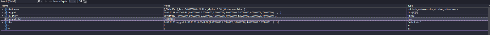

# Week 7 Advanced Programming - Lab F

This tutorial introduces the reader to both template classes and recursive functions

---

## Q1. Template Grid

### Question

Copy your `Grid` class (both the `Grid.h` and `Grid.cpp`) from lab D (or from the Grid part in Lab E if you want to add more functionality but lab D is fine for this week's work) into the Grid Project.
You are going to turn the `Grid` class into a **template** class so that we can store any type of number, e.g. float, int, double, into our 2D grid array.

In the header file `Grid.h`, add the following immediately above the class definition:

```c++
template<class T>
```

The type `T` is going to represent any number type.  Therefore you need to replace the `int` for our `m_grid` data member to be of this `T` type instead:

```c++
T m_grid[9][9];
```

Add the code in the `main()` method with the following:

```c++
Grid<int> grid;
grid.LoadGrid("Grid1.txt");
grid.SaveGrid("OutGrid.txt");
```

This is creating a new Grid that will store `int` types.

You should see that if you try to compile your code that it fails to compile.  This is because a template class must have all of the code in the header file.  Therefore move the code from the methods of your `Grid.cpp` file into the methods in the header file `Grid.h`. Then remove `Grid.cpp` from your project.  You should now find that your code compiles.

Run your code any you should have the same result as when you completed this task in Lab D.

#### [LAB BOOK - Add your `Grid.h` code]

### Answer

I first started by copying my code from a few weeks ago into this new solution. I altered my grid class to be a template and added the new 'main' logic.

#### main.cpp
```cpp
#include <iostream>
#include "Grid.h"
using namespace std;

int main (int, char**) {
	Grid<int> grid;
	grid.LoadGrid("Grid1.txt");
	grid.SaveGrid("OutGrid.txt");

	return 0;
}
```

#### grid.h
```cpp
#pragma once
#include <iostream>

template<class T>
class Grid
{
public:
	Grid();
	~Grid();

	void LoadGrid(const char filename[]);
	void SaveGrid(const char filename[]);
	friend std::ostream& operator << (std::ostream& os, const Grid& grid);
	friend std::istream& operator >> (std::istream& is, Grid& grid);

private:
	T m_grid[9][9];

};
```
#### grid.cpp
```cpp
#include "Grid.h"
#include <fstream> 
#include <iostream> 

Grid::Grid() {}
Grid::~Grid() {}


void Grid::LoadGrid(const char filename[])
{
    std::ifstream fileStream(filename);

    if (!fileStream)
    {
        std::cout << "Could not open the file: " << filename << std::endl;
        return;
    }

    for (int y = 0; y < 9; ++y)
    {
        for (int x = 0; x < 9; ++x)
        {
            fileStream >> m_grid[y][x];
        }
    }

    fileStream.close();
}

void Grid::SaveGrid(const char filename[])
{
    std::ofstream fileStream(filename);

    if (!fileStream)
    {
        std::cout << "Could not open the file: " << filename << std::endl;
        return;
    }

    for (int y = 0; y < 9; ++y)
    {
        for (int x = 0; x < 9; ++x)
        {
            fileStream << m_grid[y][x] << " ";
        }
        fileStream << std::endl;
    }
    fileStream.close();
}

std::ostream& operator << (std::ostream& os, const Grid& grid) {
    for (int y = 0; y < 9; ++y)
    {
        for (int x = 0; x < 9; ++x)
        {
            os << grid.m_grid[y][x] << " ";
        }
        os << std::endl;
    }
    return os;
}

std::istream& operator >> (std::istream& is, Grid& grid) {
    for (int y = 0; y < 9; ++y)
    {
        for (int x = 0; x < 9; ++x)
        {
            is >> grid.m_grid[y][x];
        }
    }
    return is;
}
```

I then moved all of my code from my grid.cpp into my grid.h, leaving me now with two files, main.cpp, and grid.h. Here are them now

#### main.cpp
```cpp
#include <iostream>
#include "Grid.h"
using namespace std;

int main (int, char**) {
	Grid<int> grid;
	grid.LoadGrid("Grid1.txt");
	std::cout << grid;
	grid.SaveGrid("OutGrid.txt");

	return 0;
}
```

#### grid.h
```cpp
#pragma once
#include <iostream>
#include <fstream>

template<class T>
class Grid
{
public:
    Grid() = default;
    ~Grid() = default;

    void LoadGrid(const char* filename); 
    void SaveGrid(const char* filename);

    friend std::ostream& operator<<(std::ostream& os, const Grid<T>& grid) {
        for (int y = 0; y < 9; ++y) {
            for (int x = 0; x < 9; ++x) {
                os << grid.m_grid[y][x] << " ";
            }
            os << std::endl;
        }
        return os;
    }

    friend std::istream& operator>>(std::istream& is, Grid<T>& grid) {
        for (int y = 0; y < 9; ++y) {
            for (int x = 0; x < 9; ++x) {
                is >> grid.m_grid[y][x];
            }
        }
        return is;
    }

private:
    T m_grid[9][9];
};

template<class T>
void Grid<T>::LoadGrid(const char* filename) 
{
    std::ifstream fileStream(filename);
    if (!fileStream) {
        std::cout << "Could not open the file: " << filename << std::endl;
        return;
    }

    for (int y = 0; y < 9; ++y) {
        for (int x = 0; x < 9; ++x) {
            fileStream >> m_grid[y][x];
        }
    }
    fileStream.close();
}

template<class T>
void Grid<T>::SaveGrid(const char* filename)
{
    std::ofstream fileStream(filename);
    if (!fileStream) {
        std::cout << "Could not open the file: " << filename << std::endl;
        return;
    }

    for (int y = 0; y < 9; ++y) {
        for (int x = 0; x < 9; ++x) {
            fileStream << m_grid[y][x] << " ";
        }
        fileStream << std::endl;
    }
    fileStream.close();
}
```

#### Output

```
1 2 3 4 5 6 7 8 9
2 3 4 5 6 7 8 9 1
3 4 5 6 7 8 9 1 2
4 5 6 7 8 9 1 2 3
5 6 7 8 9 1 2 3 4
6 7 8 9 1 2 3 4 5
7 8 9 1 2 3 4 5 6
8 9 1 2 3 4 5 6 7
9 1 2 3 4 5 6 7 8

D:\Files\Documents\#UNIY2\AP\AdvancedCourseworkWeeklyAssignments\Week6\Classroom\Debug\Grid.exe (process 31428) exited with code 0.
To automatically close the console when debugging stops, enable Tools->Options->Debugging->Automatically close the console when debugging stops.
Press any key to close this window . . .
```

I also verified that the contents of grid1.txt was being correctly copied over to outgrid1.txt. As you can see, I have had to move the overloaded streaming operators inside of the class definition. This is because when I copied them over and treat them like the other functions, I was getting a linker error 'LNK2019'. I looked this up and to my understanding this error means that the linker could not find a definition for something that is declared but not defined. I found an easy fix online that involves moving them into the class definition to ensure that they are instantiated and therefore can be found. I do not know if this is considered bad practice or not, or if there is a better way to do this however. 


---

## Q2. Template Grid (floats)

### Question

Change the code in `main()` so that you can store `float` values instead of `int` values, i.e. `Grid<float> grid`

Run your code and step through the `LoadGrid()` method and you should see that the numbers are being stored as `float` values instead of `int` values.  The output file may still look like `int` values, because the streaming `operator<<` is doing a conversion.

Change some of the values in the `Grid1.txt` to floating point values and you should see the output is now correct.

#### [LAB BOOK - Add your the code from your `main()` function.  Add the output of `OutGrid.txt`.  Add a screenshot of the debugger showing the contents of the `grid` instance in main() after it has successfully loaded the values from file.]

### Answer

I altered my main.cpp file to be like this.

```cpp
#include <iostream>
#include "Grid.h"
using namespace std;

int main (int, char**) {
	Grid<float> grid;
	grid.LoadGrid("Grid1.txt");
	std::cout << grid;
	grid.SaveGrid("OutGrid.txt");

	return 0;
}
```

and my grid1.txt file to be like this.

```
1.5 2 3 4 5 6 7 8 9
2 3 4 5 6 7 8 9 1
3 4 5 6 7 8 9 1 2
4 5 6 7.5 8 9 1 2 3
5 6 7 8 9 1 2 3 4
6 7 8 9 1 2 3 4 5
7 8 9 1 2 3 4 5 6
8 9.99 1 2 3 4 5 6 7
9 1 2 3 4 5 6 7 8
```

However, when I ran the program I received this as output.

```
1 2 3 4 5 6 7 8 9
2 3 4 5 6 7 8 9 1
3 4 5 6 7 8 9 1 2
4 5 6 7 8 9 1 2 3
5 6 7 8 9 1 2 3 4
6 7 8 9 1 2 3 4 5
7 8 9 1 2 3 4 5 6
8 9 1 2 3 4 5 6 7
9 1 2 3 4 5 6 7 8

D:\Files\Documents\#UNIY2\AP\AdvancedCourseworkWeeklyAssignments\Week6\Classroom\Debug\Grid.exe (process 28796) exited with code 0.
To automatically close the console when debugging stops, enable Tools->Options->Debugging->Automatically close the console when debugging stops.
Press any key to close this window . . .
```

I checked the contents of my outgrid.txt and saw this.

```
1 2 3 4 5 6 7 8 9 
2 3 4 5 6 7 8 9 1 
3 4 5 6 7 8 9 1 2 
4 5 6 7 8 9 1 2 3 
5 6 7 8 9 1 2 3 4 
6 7 8 9 1 2 3 4 5 
7 8 9 1 2 3 4 5 6 
8 9 1 2 3 4 5 6 7 
9 1 2 3 4 5 6 7 8 
```

Something has clearly gone wrong somewhere as the program is not correctly displaying or saving the appropriate numbers. I put a breakpoint on my ```LoadGrid()``` function and stepped through my program to ensure it was saving them as integers. The program was correctly saving them as float values, however, instead of saving the first number as 1.5, it was saving it as 1.0.


 ``` 		m_grid[y][x]	1.00000000	float ```

 I was really confused. I made a small if statement to check if ifstream was failing, I got into a small rabbit hole about different locales and if the decimal point in my input file was throwing the system off track, I even made this small function to specifically test if it was an issue with my ```LoadGrid()``` function as a whole or if it was ifstream acting funky.

 ```cpp
float LoadSingleNumber(const char* filename) {
	std::ifstream fileStream(filename);
	float number;
	fileStream >> number;
	return number;
}
```

To no avail, even this function was returning a float of 1.0 rather than 1.5. I know the answer would probably be obvious to me in a few weeks, but unfortunately as of right now I am not a few weeks older. 

#### Update: A day later

through my git commit history, I figured out why my program was not functioning as intended. As it turns out I was editing the grid1.txt file of 2 weeks ago, not the one that this program is using. I realised this, changed this weeks grid1.txt, ran my program, and it performed as expected.

**main.cpp**
```cpp
#include <iostream>
#include "Grid.h"

float LoadSingleNumber(const char* filename) {
	std::ifstream fileStream(filename);
	float number;
	fileStream >> number;
	return number;
}

int main(int, char**) {
	Grid<float> grid;
	grid.LoadGrid("Grid1.txt");
	std::cout << grid;
	grid.SaveGrid("OutGrid.txt");

	//float num = LoadSingleNumber("Grid1.txt");
	//std::cout << num << std::endl;
	return 0;
}
```

**Output**
```
1.5 2 3 4 5 6 7 8 9
2 3 4 5 6 7 8 9 1
3 4 5 6 7 8 9 1 2
4 5 6 7 8 9 1 2 3
5 6 7 8 9.99 1 2 3 4
6 7 8 9 1 2 3 4 5
7 8 9 1 2 3.14 4 5 6
8 9 1 2 3 4 5 6 7
9 1 2 3 4 5 6 7 8

D:\Files\Documents\#UNIY2\AP\AdvancedCourseworkWeeklyAssignments\Week6\Classroom\Debug\Grid.exe (process 22260) exited with code 0.
To automatically close the console when debugging stops, enable Tools->Options->Debugging->Automatically close the console when debugging stops.
Press any key to close this window . . .
```

**grid1.txt**
```
1.5 2 3 4 5 6 7 8 9
2 3 4 5 6 7 8 9 1
3 4 5 6 7 8 9 1 2
4 5 6 7 8 9 1 2 3
5 6 7 8 9.99 1 2 3 4
6 7 8 9 1 2 3 4 5
7 8 9 1 2 3.14 4 5 6
8 9 1 2 3 4 5 6 7
9 1 2 3 4 5 6 7 8
```

**outgrid.txt**
```
1.5 2 3 4 5 6 7 8 9 
2 3 4 5 6 7 8 9 1 
3 4 5 6 7 8 9 1 2 
4 5 6 7 8 9 1 2 3 
5 6 7 8 9.99 1 2 3 4 
6 7 8 9 1 2 3 4 5 
7 8 9 1 2 3.14 4 5 6 
8 9 1 2 3 4 5 6 7 
9 1 2 3 4 5 6 7 8 
```

I thought about deleting the previous section and rewriting all of this, as it almost seems pointless to keep in. However, I think it is funny and a good example that sometimes all it takes is a step back and a day or two for the solution to be painfully obvious.
## Q3. Binary search

### Question

In this exercise, you'll implement two versions of a binary search, one using iteration, the other using a recursive function.

The text file (binarysearchIn.txt) contains 100 integers, ordered from small to large.

Create a 100 element 1D array and read the numbers from the file into the array, using the streaming operators.

Check the array within the debugger to ensure that your input code is functioning correctly.

A binary search algorithm tests a candidate value against the value stored in the middle of the array.  If the candidate is smaller, the process is repeated on the lower half of the array.  If the candidate is larger, the process is repeated on the upper half of the array.  The process is repeated until either the middle of the sub-array contains the candidate value (the candidate is found), or the sub-array contains only a single value which is not equal to the candidate value (the candidate is not in the array).  

Implement this process using a recursive function, with the following prototype

```c++
bool binarySearch(int *list, int size, int value);
```

Now create a second implementation, replacing the recursive function with a single while loop

Which implementation do you prefer, in terms of both readability and design intent?

### Answer

I started making my two binary search algorithm, however, I wanted to challenge myself a bit and give the user the index at which the value was found, and also the amount of 'tries' it took.

I will document my creation of the first recursion binary search function, then move onto translating that into a while based one. After these are done I will look into trying to log the found index and maybe perhaps having the ability for the list of numbers to be usable with any number type (decimal and integer), and making the list dynamically change size depending on input if I have time and can be bothered.

I started out by creating a way to input the integers from the file into an array in my main function. 

```cpp
int main(int, char**) {
	int numlist[100];
	std::ifstream file("binarysearchIn.txt");
	int i = 0;

	while (file >> numlist[i]) {
		i++;
	}
	file.close();

	int value;
	std::cout << "Enter a value to search: ";
	std::cin >> value;

	std::cout << "Recursion Binary Search\n";
	recursionBinarySearch(numlist, i, value);
	return 0;
}
```

By doing it like this, the 'size' parameter is dynamically passed into my ```recursionBinarySearch()``` function, and I can choose the value for quicker testing.

```cpp
bool recursionBinarySearch(int* list, int size, int value) {
	static int tries = 0;
	if (size == 0) {
		return false;
	}
	int mid = size / 2; 
	if (list[mid] == value) {
		std::cout << "Found " << value << "\n";
		std::cout << "Tries: " << tries << std::endl;
		tries = 0;
		return true;
	}
	else if (list[mid] > value) {
		tries++;
		return recursionBinarySearch(list, mid, value);
	}
	else {
		tries++;
		return recursionBinarySearch(list + mid + 1, size - mid - 1, value);
	}
}
```

It was mentioned in a much earlier lecture the function of the static modifier, I thought here is a perfect place to implement it. I'm still unsure on what the general consensus is on about using static like this, however, this will only last shortly as I need to make a wrapper function anyways if I want a good way to log the index of which the desired value is at.

Before altering my recursion binary search I moved onto my while binary search, also altering my main function to call it.

```cpp
int main(int, char**) {
	int numlist[100];
	std::ifstream file("binarysearchIn.txt");
	int i = 0;

	while (file >> numlist[i]) {
		i++;
	}
	file.close();

	int value;
	std::cout << "Enter a value to search: ";
	std::cin >> value;

	std::cout << "Recursion Binary Search\n";
	recursionBinarySearch(numlist, i, value);

	std::cout << "\n";

	std::cout << "While Binary Search" << std::endl;
	whileBinarySearch(numlist, i, value);

	return 0;
}
```

```cpp
bool whileBinarySearch(int* list, int size, int value) {
	int tries = 0;
	int start = 0;
	int end = size - 1;
	while (start <= end) {
		tries++;
		int mid = (start + end) / 2;
		if (list[mid] == value) {
			std::cout << "Found\n";
			std::cout << "Tries: " << tries << std::endl;
			return true;
		}
		else if (list[mid] > value) {
			end = mid - 1;
		}
		else {
			start = mid + 1;
		}
	}
	std::cout << "Not found\n";
	std::cout << "Tries: " << tries << std::endl;
	return false;
}
```

As you can see this uses a different (and much nicer) way of choosing the middle element is chosen, and how it handles how the updating of subarray bounds is much more readable. Furthermore, I noticed a difference in the output of number of tries between the two implementations. This should not be the case, as for the same list and the same search value, the number of comparisons should be identical between a recursive and iterative implementation.

```
Enter a value to search: 45
Recursion Binary Search
Found
Tries: 5

While Binary Search
Found
Tries: 7

D:\Files\Documents\#UNIY2\AP\AdvancedCourseworkWeeklyAssignments\Week6\Classroom\Debug\Binary Search.exe (process 2840) exited with code 0.
To automatically close the console when debugging stops, enable Tools->Options->Debugging->Automatically close the console when debugging stops.
Press any key to close this window . . .
```

There is only so much you can take this recursive binary search function without having to implement a wrapper. I added a wrapper and also a way to show index of the found value.

```cpp
bool recursionBinarySearch(int* list, int start, int end, int value, int& tries, int& index) {
	if (start > end) {
		return false;
	}
	int mid = start + (end - start) / 2;
	tries++;
	if (list[mid] == value) {
		index = mid;
		return true;
	}
	else if (list[mid] > value) {
		return recursionBinarySearch(list, start, mid - 1, value, tries, index);
	}
	else {
		return recursionBinarySearch(list, mid + 1, end, value, tries, index);
	}
}


bool recursionBinarySearch(int* list, int size, int value) {
	static int tries = 0;
	tries = 0;
	int index = -1;
	bool found = recursionBinarySearch(list, 0, size - 1, value, tries, index);
	std::cout << (found ? "Found\n": "Not found\n");
	if (index != -1) {
		std::cout << "Index: " << index << "\n";
	
	}
	std::cout << "Tries: " << tries << std::endl;
	return found;
}
```
To my knowledge there is not a way to implement the ability to show index in this context without using a wrapper, as simply using mid at any point in the single function recursive binary search will only give the index of the subarray.

I also added the ability to show index into the iterative binary search.

```cpp
bool whileBinarySearch(int* list, int size, int value) {
	int tries = 0;
	int start = 0;
	int end = size - 1;
	while (start <= end) {
		tries++;
		int mid = (start + end) / 2;
		if (list[mid] == value) {
			std::cout << "Found\n";
			std::cout << "Index: " << mid << "\n";
			std::cout << "Tries: " << tries << std::endl;
			return true;
		}
		else if (list[mid] > value) {
			end = mid - 1;
		}
		else {
			start = mid + 1;
		}
	}
	std::cout << "Not found\n";
	std::cout << "Tries: " << tries << std::endl;
	return false;
}
```

My main point of adding small additional features like tries and index were not only because it is fun, but to also show scalability. The recursive algorithm needs a separate wrapper function just to work as intended and to implement small additional features. For me, the iterative function is much more accessible and easier to read/debug. Not only that but to my knowledge, while both implementations have a time complexity of O(logn), the space complexity wildly differs from the two, with the recursive version being O(logn), and the iterative version being O(1). This is because as the list to search gets bigger, the call stack for the recursive implementation grows exponentially, potentially leading to a stack overflow if it becomes too deep.

Although it was fun to implement a binary search in a recursive way, I do not see myself doing it again. However, I am still largely naive to the world of C++ and system programming, so there might be an obscure use case for it.

## Reflection

Throughout this lab I have furthered my knowledge of templates, and the different ways to implement binary search in C++. Even though it took an extra to day to realise my simple mistake on the grid question, I really like the notion of templates and I can't wait to use them at scale in bigger projects. Despite having implemented binary searches in other languages before, it is nice to see how that translates to C++. At this current stage, despite the fact I am still admittedly somewhat reliant on a search bar for more complex questions and explanations to more advanced topics to fully understand them, I feel like I am making steady progress.

The more time I spend with C++, the more I enjoy it and the more intuitive it is to write and read. Like I say every time in these labs, I know I have a long way to go with this language and even programming in general, but the way these labs are structured I find it much easier to digest these topics presented. 