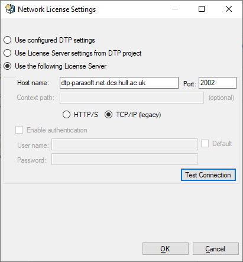
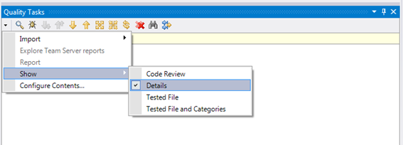
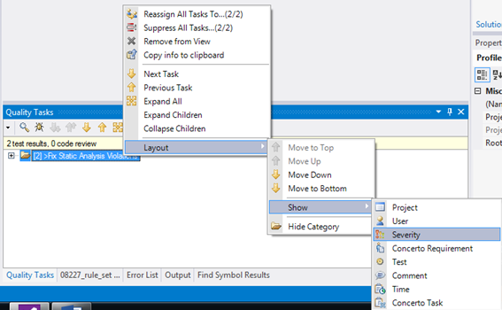

# Advanced Programming - Lab G

This tutorial introduces the reader how to use Parasoft.

---

## Q1. Parasoft

### Installing Parasoft C/C++ Test

You **MUST** have Visual Studio Enterprise 2019 installed for Parasoft to work. Details of who to get this version can be found on [Canvas](https://canvas.hull.ac.uk/courses/17835/pages/setting-up-your-pc).

Close Visual Studio if you have it open.

Download Parasoft C/C++ Test Visual Studio plugin from [Box](https://universityofhull.app.box.com/s/yw9jl9hd086m0waulz5pe42kbolcg06e) and install it, by double-clicking the download and following the instructions (You may need to disable your virus software whilst it installs - remember to turn your virus software back on once it has been installed).

Restart Visual Studio and select `Parasoft->Peferences`, and select the `License` tab.  Then select `configure...`

Select `Use the following License Server` and then enter the Host name `dtp-parasoft.net.dcs.hull.ac.uk` and port number `2002`, `TCP/IP (legacy)` and hit `OK` then hit `Apply` - **for this to work you MUST to be connected to the University VPN using Global Connect**

Parasoft should now be installed and licensed (you may need to follow the next step before it is licensed)

### Installing Parasoft C++ Test Rule Set

Open the Visual Studio Project called Parasoft that comes with this lab.

You need to install the 500083 rule set:

1. Open the the `C:/temp/` folder, and then download the `500083_rule_set` file and the `rule_downgrades` file from Canvas to `C:/temp/` folder.
2. Select `Parasoft` -> `Test Configurations` from the menu in Visual Studio.
3. Right-click on User-defined and select `Import`.
4. Import the `500083_rule_set` file from the `C:/temp/`
5. Then right-click on the `500083 rule set` and select `Set As Favorite` and select the first item in the list.
6. Select the `Static` tab
7. Select the `Edit Rulemap` button
8. Select the `Import` button and the select the xml file from the `C:/temp/` folder, and then select `open`
9. Select the `Save Changes` button, then `OK`.
10. Select the `Apply` button.
You should see that 155 rules are enabled.
11. Select `Close`.

Please close Visual Studio, and then restart it.

### Using Parasoft C/C++ Test

These are instructions for using Parasoft C/C++ Test:

**To run Parasoft you'll need to connect to the University VPN (see [Canvas](https://canvas.hull.ac.uk/courses/17835/pages/setting-up-your-pc)) so that Parasoft is able to contact its license server.**

It is important to know that Parasoft will only validate the currently selected files in the **Solution Explorer**. Therefore, if you want Parasoft to validate all of your code, then select the project in the **Solution Explorer** before running the test.  If you only want to run Parasoft on a selection of code, then select the files in the **Solution Explorer** before running the test. 
Select `Parasoft` -> `Test` Using `500083 rule set` from the menu. The first run may time a few minutes to complete; please be patient.

When the test is complete it will state how many violations have been found.

To view these violations press the `Review Tasks` button.

You should now select the drop down arrow and select Show -> Details as in Fig 1.

Fig 1. `Show` -> `Details`

You should now right click in the **Quality Tasks** window and select `Layout` -> `Show` -> `Severity` as in Fig 2.

Fig 2. `Layout` -> `Show` -> `Severity`

You can now navigate down the list to find out the violations. When you navigate down to a specific line violation, double-click that line violation and you will be sent to the violated line of code in Visual Studio.
You should find that there are 10 violations.

There is HTML based documentation for all of the 155 rules in the `500083 rule set`.  These documents contain description of each rule, and have example code that will generate a violation with the corrected code that will pass the rule.  The documentation can be found by right-clicking on a violation (in the Quality Tasks tab) and selecting View Rule Documentation.

You can also generate a report that will list the violations in a number of ways:

1. Go to the `500083 rule set` tab and press the `Generate Report` button and select OK.
2. Allow any blocked content if you get a security message.
3. Then select **Severity** to order your violations by their importance. 

**Your final lab work mark will be reduced if you have any severity 1, 2 or 3 violations.  Severity 4 and 5 can be treated as warnings.**

We are going to fix the first Severity 3 rule violation in `Utility.cpp` that Parasoft displays `>[Line 27] Declare local variable 'result' as const`

1. Go to the line of code (line 27 of `Utility.cpp`); this can be done by double-clicking on the violation.
2. We are creating a local variable called result, however we do not change the value of result after creating it.  Therefore, we should make this const as we do not change its value.
3. Change this line appropriately.
4. Re-run Parasoft on the whole project, and you should see that there are now 10 violations, as we have now fixed the one on line 27.

Correct the other Severity 3 violations.  Do not worry about the other violations as you may not have covered these yet in the module.

#### [Lab Book - Add screenshots of the Parasoft violation output.  Then describe the corrections you made to remove the Parasoft Severity 3 violations]
